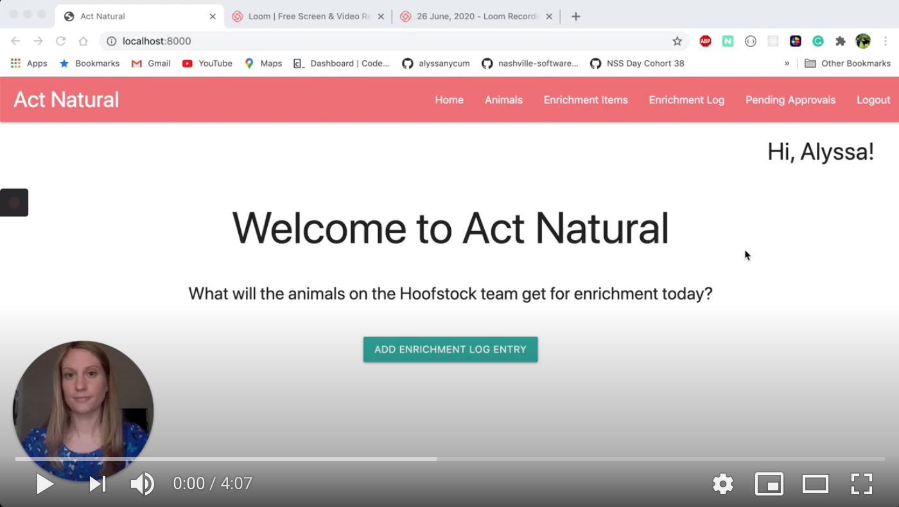

# Act Natural

## Why was it created?
Enrichment is used in zoos to enhance the welfare of the animals by stimulating their minds and encouraging them to display natural behaviors. When I was a zookeeper, there wasn't one all-encompassing, easily accessed place where all of the information around enrichment was kept track of which led to a lot of disorganization and confusion around which items were officially approved for which animals. I created Act Natural so zookeepers could quickly access a list of approved enrichment items for the animals on their team and record enrichment log entries to keep track of which enrichment item each animal is getting each day. 

## What does it do?
Act Natural allows keepers to collaborate with their fellow team members by being able to view/add/edit/delete animals, enrichment items, and enrichment log entries to their team's dashboard.

## Technologies used:
* Python
* Django
* Django ORM
* JavaScript
* CSS
* Materialize CSS
* Pillow for Python
* TablePlus
* Visual Studio Code
* Git/GitHub

## Installations to test locally:

1. Clone this repo by pasting the SSH key in your terminal and cd into it:
```shell session
$ git clone git@github.com:alyssanycum/ActNatural.git && cd $_
```

2. Create your OSX/Linux OS virtual environment in Terminal:
```shell session
$ python -m venv actnaturalEnv
$ source ./actnaturalEnv/bin/activate
```

OR

Create your Windows virtual environment in Command Line:
```shell session
$ python -m venv actnaturalEnv
$ source ./actnaturalEnv/Scripts/activate
```

3. Install the app's dependencies:
```shell session
$ pip install -r requirements.txt
```

4. Build your database from the existing models:
```shell session
$ python manage.py makemigrations actnatural app
$ python manage.py migrate
```

5. Create a superuser for your local version of the app:
```shell session
$ python manage.py createsuperuser
```

6. Run your server:
```shell session
$ python manage.py runserver
```

7. Open http://localhost:8000 in your browser

## Demo

<a href="https://www.youtube.com/embed/wD8I59EqAAY
" target="_blank"></a>